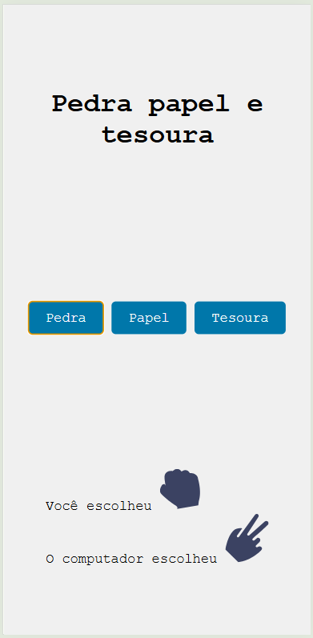

# Pedra Papel Tesoura
Atividade de front-end para aprenser github fork e pullrequest

## Tecnologias
- VsCode
- HTML, CSS, JavaScript

## Passo a passo para testar
- Clone o repositório
- Abra com VsCode
- Execute o index.html com o Live Server

## Print
